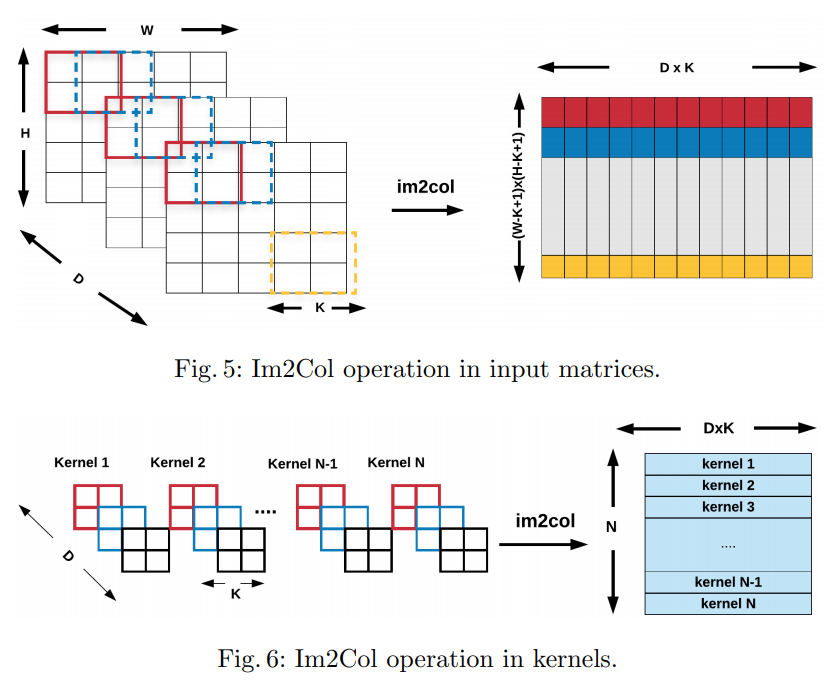
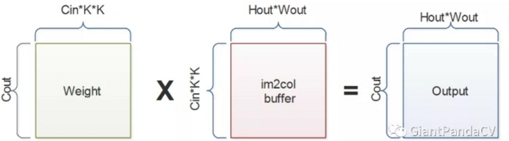
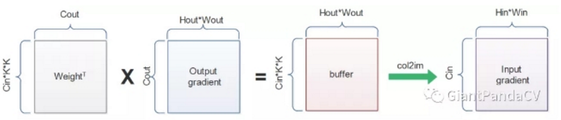

### im2col

#### im2col 实现

im2col 示意图：

(下图有一些错误：右边标识的 DxK 都应该是 DxKxK，右上的图应该逆时针转 90 度，即各个区域拉成列向量而不是行向量，左上的图的不同颜色应该按 D 区分而不是在 HW 上。)

由此，卷积直接就变成了 W 矩阵乘 X 矩阵(im2col buffer)，大矩阵乘法已经有很多现成库可以用了。

$\{C_{out} \times C_{in} * K * K\} \cdot \{C_{in} * K * K \times H_{out} * W_{out}\}$ 

再接一个 reshape 就是了。

#### 复杂度分析

事实上时间复杂度并没有改变，不过有个优点就是它具有了矩阵乘法 gemm 的性质，这样线性代数上的所有技巧用在这里。

### 卷积的反向传播

根据 im2col 的方法，卷积前向已经表示为 Y = WX + b，假设 loss = f(Y)，那么 loss 关于 X 的梯度为：

dl/dX = W^T * dl/df

$\{C_{in} * K * K \times C_{out}\} \cdot \{C_{out} \times H_{out} * W_{out}\} $ 

也就可以表示为下图的过程：

同理，loss 关于 W 的梯度为：

dl/dW = dl/df * X^T

$\{C_{out} \times H_{out} * W_{out}\}  \cdot  \{H_{out} * W_{out} \times C_{in} * K * K\}$

#### col2im

im2col 把 $C_{in} * H_{in} * W_{in} $ 转成了 $C_{in} * K*K \times H_{out} * W_{out}$，col2im 就是个按滑窗反填的过程，主要是用在反向传播的时候。

### 反卷积

#### gemm + col2im 实现

反卷积的实现实际上就可以通过互换前后向传播实现，权重转置乘输入就能得到 size 增大的输出。

#### 输入插空补 0 实现

对于 x 补零，0 的个数为反卷积放大倍数，再拿权重翻转 180° 以 stride = 1 来卷积即可，这种方法称作转置卷积。

#### 棋盘格效应与解决方案

当 `kernel_size` 无法被  `stride` 整除时, 反卷积就会出现这种不均匀重叠的现象。

解决方案一是可以通过合理配置反卷积的参数(stride, pad, kernel size)，等效于亚像素卷积，但治标不治本。

解决方案二是可以用上采样 + 卷积替代反卷积。