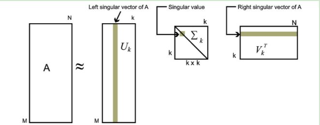

https://zhuanlan.zhihu.com/p/29846048

https://zhuanlan.zhihu.com/p/59324612

证明部分都可以跳过。

### 背景知识

首先看什么是矩阵分解，以及矩阵分解有什么意义。

#### 实对称矩阵的特征值分解

首先回顾下特征值和特征向量的定义如下：
$$
Ax = \lambda x
$$

其中 $A$ 是一个 $n \times n$ 的矩阵(为了能够使用下面的分解方式，还得是个实对称矩阵)， $x$ 是一个 $n$ 维向量，则 $\lambda$ 是矩阵 $A$ 的一个特征值，而 $x$ 是矩阵 $A$ 的特征值 $ \lambda $ 所对应的特征向量。

求出特征值和特征向量有什么好处呢？ 就是我们可以将矩阵A特征分解。如果我们求出了矩阵 $A$ 的 $n$ 个特征值 $\lambda_{1} \leq \lambda_{2} \leq \ldots \leq \lambda_{n}$ ，以及这 $n$ 个特征值所对应的特征向量 $w_{1}, w_{2}, \dots, w_{n}$，

那么矩阵 $A$ 就可以用下式的特征分解表示：
$$
A=W \Sigma W^{-1}
$$
其中 $W$ 是这 $n$ 个特征向量所张成的 $n×n$ 维矩阵，而 $Σ$ 为这 $n$ 个特征值为主对角线的 $n×n$ 维对称矩阵。

> 证明：

另外一般我们会把 $W$ 的这 $n$ 个特征向量标准化，即满足 $w_i^Tw_i = 1$，此时 $W$ 的 $n$ 个特征向量为标准正交基，满足 $W^{T}=W^{-1}$，这样的矩阵称之为酉矩阵。

> 证明：

这样我们的特征分解表达式可以写成：
$$
A=W \Sigma W^{T}
$$
注意到因为要进行特征分解，矩阵 $A$ 必须为方阵。

#### 矩阵分解的意义

一般我们把特征向量和特征值在 $W$ 和 $\Sigma$ 中按特征值从大到小排列，观察的话会有一个现象：特征值减小的非常快，在很多情况下，前 10% 甚至 1% 的奇异值的和就占了全部的奇异值之和的 99% 以上的比例。

也就是说我们可以用最大的 $k$ 个的特征值和对应的左右奇异向量来近似描述矩阵。

### SVD - 奇异值分解

如果矩阵 $A$ 不是方阵，特征值分解就行不通了，这时可以通过 SVD 进行分解。

#### SVD 的定义

首先来看 SVD 的定义，之后我们再来解释为什么可以这样分解，以及每个矩阵是什么。

假设我们的矩阵 $A$ 是一个 $m×n$ 的矩阵，那么我们定义矩阵 $A$ 的 SVD 为：
$$
A=U \Sigma V^{T}
$$
其中 $U$ 是一个 $m \times m$ 的酉矩阵， $V$ 是一个 $n \times n$ 的酉矩阵， $\Sigma$ 是一个 $m \times n$ 的矩阵，除了主对角线上的元素以外全为0，主对角线上的每个元素都称为奇异值。

#### $U$, $V$, $\Sigma$ 矩阵的含义

首先我们假设不知道这三个矩阵的具体内容，对于 $A=U \Sigma V^{T}$，我们有 $A^T = V\Sigma^TU^T$，由此，
$$
AA^T = U\Sigma V^TV\Sigma^TU^T = U\Sigma^2U^T
$$
上式证明使用了 $V^TV = I$ 和 $\Sigma = \Sigma^T$。同理，
$$
A^TA = V\Sigma^2V^T
$$
也就是说 $U$ 矩阵是 $AA^T$ 矩阵的特征向量组成的矩阵，而 $V$ 矩阵是 $A^TA$ 的特征向量组成的矩阵。

进一步我们还可以看到特征值矩阵等于奇异值矩阵的平方，即 $\sigma_i = \sqrt{\lambda_i}$。

#### Naive Solution of SVD 

由含义可以直接得出暴力计算方式：

1. 分别计算 $AA^T$ 和 $A^TA$ 的特征值和特征向量(都是标准化的)；
2. 按特征值从大到小，将 $AA^T$ 的特征向量组成 $U$，特征值开根号组成 $\Sigma$；
3. 按特征值从大到小，将 $A^TA$ 的特征向量组成 $V$。

但注意，$AA^T$ 或 $A^TA$ 很可能特别大，因此有很多算法并没有这么计算，而是通过其它方法直接获得 $U$, $\Sigma$, $V$，甚至 SVD 可以实现并行化，因此在大数据的情况下更能体现出优势。

> 这里提的计算方法只是为了讲清楚这三个矩阵的含义，并且方便给出证明这么分解是对的。具体怎么通过不计算协方差的特征值来求解 SVD 是有很多后续研究的，不是一篇简单的科普教程能讲清楚的，不求甚解的话，就记住高级的算法可以绕过这一步直接得到三个矩阵，如果实在感兴趣的话可以看一下 NIPS 2007 的文章 Fast SVD for large-scale matrices.

#### SVD 分解的意义

和矩阵分解的意义类似，我们可以用最大的 $k$ 个的奇异值和对应的左右奇异向量来近似描述矩阵。
$$
A_{m \times n}=U_{m \times m} \Sigma_{m \times n} V_{n \times n}^{T} \approx U_{m \times k} \Sigma_{k \times k} V_{k \times n}^{T}
$$
当 $k$ 远小于 $n$ 的时候，$m\times k +  k \times k + k \times n$ 远小于 $ m \times n$ ，

也就是说，我们可以用三个更小的矩阵，来近似存储一个大矩阵。

由于这个重要的性质，SVD可以用于PCA降维，来做数据压缩和去噪。也可以用于推荐算法，将用户和喜好对应的矩阵做特征分解，进而得到隐含的用户需求来做推荐。同时也可以用于NLP中的算法，比如潜在语义索引 (LSI)。

#### SVD 用于 PCA

PCA 降维，需要找到样本协方差矩阵 $X^TX$ 的最大的 $k$ 个特征向量，然后用这最大的 $k$ 个特征向量张成的矩阵来做低维投影降维。可以看出，在这个过程中需要先求出协方差矩阵 $X^TX$ ，当样本数多样本特征数也多的时候，这个计算量是很大的。

而 SVD 中类似的求了 $A^TA$ 矩阵的特征向量张成的矩阵，就是右奇异值矩阵 $V$，
$$
X_{n \times k}^{\prime}= X_{n \times d} V_k^T
$$
并且如上面所说，**有一些 SVD 的实现算法可以不通过先求出协方差矩阵直接获得分解结果**，因此一般 PCA 的背后实现都是通过 SVD 的。

