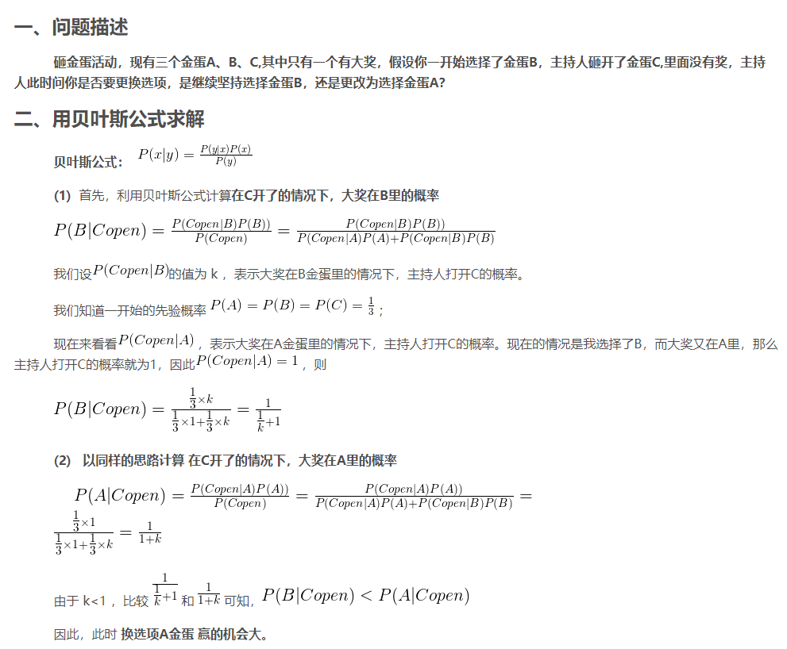
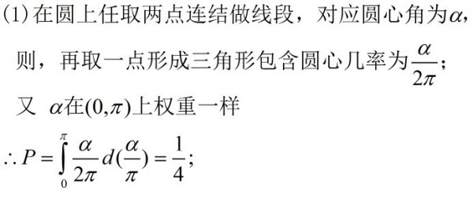

### 1. 贝叶斯公式

贝叶斯公式的关键在于定义清楚 AB 事件，然后套用逆概率公式即可

**Q1.1: 一个家庭有两个小孩，已知一个是女孩，另一个也是女孩的概率是多少？**

事件A定义为两个都是女孩(两女)，事件B定义为有一个女孩(一女)

P(A|B) = P(AB) / P(B) = P(B|A)P(A) / P(B) = 1 * 1/4 / 3/4 = 1/3

**Q1.2: 一个家庭有两个小孩，打电话过去是一个女孩接了电话，这个家庭有两个女孩的概率是多少?**

事件A定义为两个都是女孩(两女)，事件B定义为女孩接电话(女接)

P(A/B) = P(AB) / P(B) = P(B|A) P(A) / P(B)

其中 P(B|A) 为已知两女的前提下女孩接电话 = 1，P(A)为两个女孩的概率 = 1/4，

P(B) = P(女孩接电话|一男一女)P(一男一女) + P(女孩接电话 | 两女) P(两女) + P(女孩接电话 | 两男) P(两男)

​        = 1/2 * 1/2 + 1 * 1/4 + 0 * 1/4 = 1/2    注意这里第一项隐含了两个孩子接电话概率相同

所以 P(A|B) = 1/2。

**Q1.3: 已知男性色盲概率为5%，女性是0.4%，求得知一个人是色盲的前提下，这个人是男性的概率是多少？**

事件A定义为 抽中男性，事件B定义为抽中色盲。

P(A|B) = P(AB)/P(B) =  P(B|A) P(A) / P(B)

其中 P(B|A) 为男性色盲概率 = 5%，P(A)为抽中男性概率 = 50%，

P(B) = P(色盲|男)P(男) + P(色盲|女)P(女) = 0.5 * (5 + 0.4) % = 2.7%

所以 P(A|B) = 2.5/2.7 = 92.6%

**Q1.4 n个门，1个门后是车，其余n-1个门后是羊，你先选一个，如果面试官告诉你其余n-1个中某个是羊，你会重新选择么**

$P(Copen|B)$ 为奖在 B 中 主持人打开 C 的概率，如果主持人是完全随机的话 那么 k 就是1/2，换的话赢面是 2/3 不换是 1/3。

### 2. 联合概率

**Q2.1 已知 x,y,z 是互相独立的 0~1 的均匀分布，求 x + y < 1 的概率，x + y 的分布，以及 x+y+z <1 的概率**

记 k = x + y，则 x + y < 1 的累积密度函数为x=1, y=1 和 y = k - x 的下方包围的面积，也就是

当 0 < K <= 1 时 ，k < K 的概率为 1/2 K^2，得出 x + y <1 的概率为 0.5，

当 1 < K <= 2 时，k < K 的概率为 0.5 + 1/2 (2 - K)^2，对累积概率函数求导即为概率密度函数：

P(k=K) =  K,  0 < K <=1

​            =  2 - k, 1 < K <=2。

同理 x+y+z <1 的概率为边长为1的正方体的一个角的体积(三分之一底面积乘高) = 1/3 * 1/2 = 1/6

**Q2.2 圆上任意三个点组成的三角形，包含圆心的概率**

### 3. 排列组合

**Q3.1: 已知一个人打枪命中率为0.7，且每次打枪独立，他打了10枪求他中了4枪的概率？**

P = C(10, 4) * 0.7^4 * 0.3*6 

**Q3.2: 有10个球，其中黑白黄各有 3 3 4 个，取出3个球刚好是一黑一白一黄的概率?**

P = C(3,1) * C(3, 1) * C(4, 1) / C(10, 3) = 0.3

**Q3.3 54张扑克牌，平均分成3份，大小王在一份的概率**

54 张牌分成 3 等份，共有 M=  C(54, 18) * C(36, 18) * C(18, 18) 种分法。

其中大小王在同一份的分法有 N= C(3, 1) * C(52, 16) * C(36, 18) * C(18, 18) 种。

因此所求概率为P= N / M=17/53。

### 4. 几何分布

几何分布（Geometric distribution）是离散型概率分布。其中一种定义为：在伯努利试验中，前k-1次皆失败，第k次成功的概率。

$$P(X=k) = (1-p)^{k - 1} p$$

期望为: $E(X) = 1*P(X = 1) + 2*P(X=2) + ... + K*P(X=K) = \frac{1}{p}$ 是一个等差乘等比的求和

可以用错位相减法：E(x)乘上等比系数，再对位相减，用等比数列求和公式。或者裂项相消法。

方差为: $Var(X) = E(X^2) - E(X)^2 = \frac{1 - p}{p^2}$

 前一项是幂次乘等比(不太好求，写出式子后能发现是期望中表达式的求导)

https://blog.csdn.net/sinat_37321923/article/details/77493672

**4.1 两个人轮流抛硬币，先抛到正面的赢，问先抛的人赢的概率**

P(赢) = 1/2 + 1/4 * 1/2(第一局平第二局赢) + 1/4 * 1/4 * 1/2 (前两局平，第三局赢) + ...

​         = sum{0, 正无穷} (1/4)^i * 1/2

用等比数列求和公式: P = 1/2 (1 - 1/4^正无穷)/ (1 - 1/4) = 2/3 = 0.667

