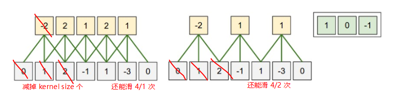
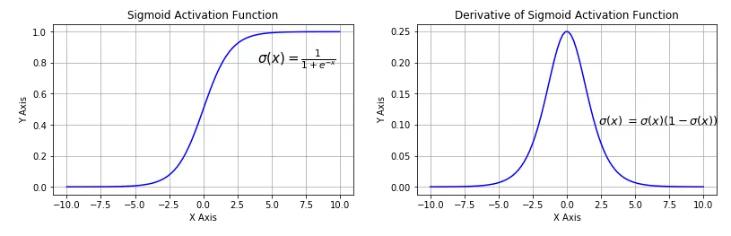
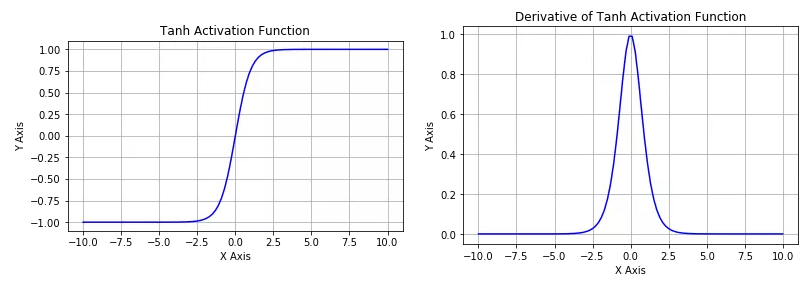
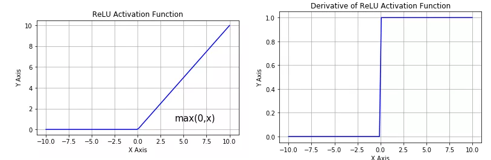
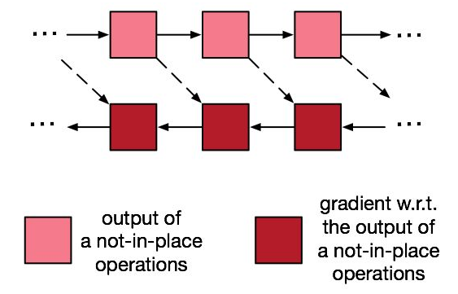
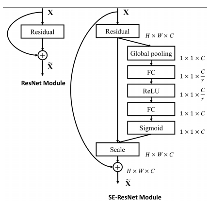
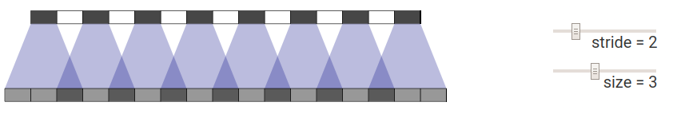
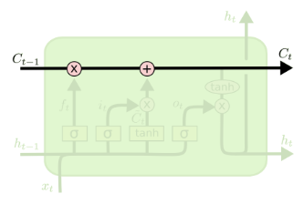
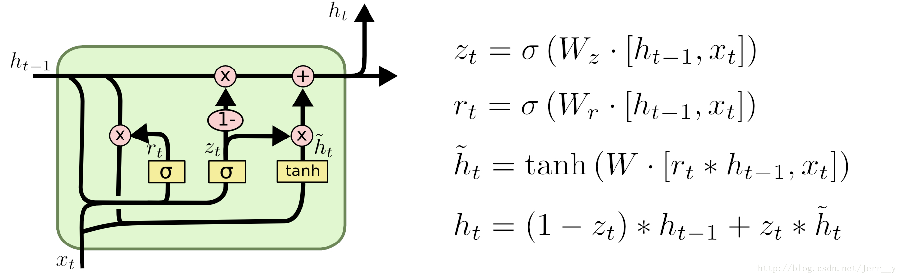
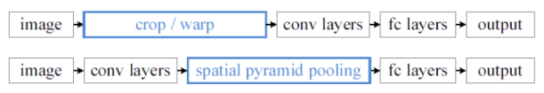

#### Q1 : 简介常见初始化方法及其思路

 

**关键点: ** 方差公式，方差不稳定性，设计思路，Xavier 和 He 的实现方法与特性。

1. 完全随机

   方差会不断变大或变小，可以由公式推出来：
   $$
   \begin{aligned}
   \operatorname{Var}\left[a^{l}\right] &=\operatorname{Var}\left[\sum_{i=1}^{n^{(l-1)}} w_{i}^{l} a_{i}^{(l-1)}\right] \\
   &=\sum_{i=1}^{n^{(l-1)}} \operatorname{Var}\left[w_{i}^{l}\right] \operatorname{Var}\left[a_{i}^{(l-1)}\right] \\
   &={n^{(l-1)} \operatorname{Var}\left[w_{i}^{l}\right]} \operatorname{Var}\left[a_{i}^{(l-1)}\right]
   \end{aligned}
   $$

2. Xavier ['zʌvɪə] 初始化

设计思路：根据完全随机中的方差公式，<u>保持输入和输出的方差一致</u>。

实现：参数初始化为均值为0，方差为 $$\frac{1}{n}$$， $$n$$ 为输入个数

```python
W = tf.Variable(np.random.randn(node_in, node_out)) / np.sqrt(node_in)
```

特性：会对用 tanh 的网络保持各层输出分布相似，但对于 ReLU 还是会存在越来越接近 0 的分布。

3. He Initialization

设计思路：在 ReLU 网络中，假定每一层有一半的神经元被激活，另一半为 0，所以，要保持方差不变，只需要在 Xavier 的方差基础上再除以2

```
W = tf.Variable(np.random.randn(node_in,node_out)) / np.sqrt(node_in/2)
```

特性：基本保持输入输出方差一致。

#### Q2: 初始化能否完全随机或全0

 

**关键点: ** 对称性，方差公式，方差不稳定性，设计思路
$$
\begin{aligned}
\operatorname{Var}\left[a^{l}\right] &=\operatorname{Var}\left[\sum_{i=1}^{n^{(l-1)}} w_{i}^{l} a_{i}^{(l-1)}\right] \\
&=\sum_{i=1}^{n^{(l-1)}} \operatorname{Var}\left[w_{i}^{l}\right] \operatorname{Var}\left[a_{i}^{(l-1)}\right] \\
&={n^{(l-1)} \operatorname{Var}\left[w_{i}^{l}\right]} \operatorname{Var}\left[a_{i}^{(l-1)}\right]
\end{aligned}
$$
绝对不行，两方面：

1. 如果所有的参数都是0，那么所有神经元的输出都将是相同的，那在back propagation的时候同一层内所有神经元的行为也是相同的 --- gradient相同，weight update也相同，这显然是一个不可接受的结果。
2. 完全随机的话，由公式可以知道高层的方差是不稳定的。也可以试验一下，设计一个简单的多层神经网络，激活函数为tanh，每一层的参数都是均值为0，标准差为 0.01 的随机正态分布，对每层的输出做直方图统计，会发现分布在高层会向0聚拢。将会导致梯度为0，参数难以更新。如果标准差改为1，每一层的输出都会集中在-1，1之间，神经元饱和，梯度无法更新。也就是说**参数的初始化要使得每一层的输出不能太大，也不能太小，最合理的方法就是使输出的标准差保持不变。**

#### Q3: 卷积扩张卷积的输出 size 的计算

 

**关键点: ** size 公式，理解方式，Dilation Conv size 公式

公式为 (W+2P - K) / S 向下取整 + 1，也就是向上取整。
$$
o = \left \lfloor \frac{(W + 2P - K )} {S} \right \rfloor + 1
$$
理解方式：减掉 k 之后 能被 stride 整除几次(也就是还能滑几次)



另外如果有 Dilation Conv，需要修改以上公式为，直接以更大的卷积核(K) 来模拟 Dilated 卷积的滑动就行了，等效 Kernel size 为 K + (K-1) * (D-1)。
$$
o= \left \lfloor \frac{W + 2P - K - (K-1)(D-1)}{s} \right \rfloor + 1
$$
即除了单独考虑一次以外，还要考虑删掉 dilation 跳过的部分。

#### Q4: 为什么需要白化

 

一般在把数据喂给机器学习模型之前，“**白化（whitening）**”是一个重要的数据预处理步骤。

由于特征之间很可能具有很强的相关性，所以用于训练时输入是冗余的。白化的目的就是降低输入的冗余性；

白化一般包含两个目的：

1. *去除特征之间的相关性* —> 独立；
2. *使得所有特征具有相同的均值和方差* —> 同分布。

#### Q5: 如何进行白化

 

白化中第一步是使特性之间的相关性降低，这一步 PCA 就可以做到了。至于第二步，只需要将方差变为相同就好。由于 PCA 的第一步计算了协方差矩阵，而其对角阵就是方差，因此对 PCA 中获得的新特征向量，如果把每个数值都除以他的标准方差就可以使全部的数值的方差变为 1 了，这就是 PCA 白化。

#### Q6: 为什么要进行 BN

 

关键点：原文的解释 ICS，为什么会 ICS，ICS 会怎样，后续的研究证明不是ICS，更合理的解释。

1. BN 的原论文中说是解决了 **深度学习中的 Internal Covariate Shift** (协方差漂移) 的问题。

   > ICS是什么: 网络中每一层都会导致上层的输入数据分布发生变化，通过层层叠加，高层的输入分布变化会非常剧烈。Google 将这一现象总结为 Internal Covariate Shift，简称 ICS。
   >
   > ICS 会怎么样: 
   >
   > 1. 底层的参数需要不断适应新的输入数据分布，降低学习速度。
   > 2. 高层的输入的变化可能趋向于变大或者变小，导致上层落入饱和区，使得学习过早停止。
   >
   > 3. 由于每层的更新都会影响到其它层，因此每层的参数更新策略需要尽可能的谨慎 (lr 减小)。

2. 实际上后续研究表明，**尽管** ICS 问题在较深的网络中确实是普遍存在的，**但是并非** 导致深层网络难以训练的根本原因。实验一方面证明：即使是应用了 BN，网络隐层中的输出仍然存在严重的ICS问题；另一方面也证明了：在 BN 层输出后人工加入噪音模拟 ICS 现象，并不妨碍 BN 的优秀表现。

3. 实际上更多的研究倾向于认为 **BN 改善了优化过程**，通过 Normalization 操作，使得网络参数重整 ( Re-parametrize ），它**对于非线性非凸问题复杂的损失曲面有很好的平滑作用**，有实验证明了用 BN 后损失曲面的平滑程度得到了很大提升。

4. Goodfollow 的**花书**里有一些直观的解释：如果没有 BN 更改某一个权重会影响后续的很多层，**BN 使得我们能够独立的控制每一层激活值的幅度和均值。**也就是"reduces second-order relationships between parameters of different layers than a method to reduce covariate shift." **减少层间参数的二阶影响**。

#### Q7: PCA 的流程

 

PCA 是为了降低特征的维度且减少特征之间的相关性。问题被转化成了，我们希望找出一组基向量（需要是标准正交基），数据在这组基向量构成的空间中表示时，任何两个属性间相关性为零。

方差定义数据的离散程度：
$$
\operatorname{Var}(a)=\frac{1}{m} \sum_{i=1}^{m}\left(a_{i}-\mu\right)^{2}
$$
协方差表示两个向量之间的相关性：
$$
\operatorname{Cov}(a, b)=\frac{1}{m} \sum_{i=1}^{m}\left(a_{i}-\mu_{a}\right)\left(b_{i}-\mu_{b}\right)
$$

1. **各个维度减去各自的均值**

   这一步是因为后面求方差和协方差时会要减均值，干脆提前减了，方便矩阵操作。
   $$
   \begin{aligned}
   \operatorname{Var}(a) &=\frac{1}{m} \sum_{i=1}^{m} a_{i}^{2} \\
   \operatorname{Cov}(a, b) &=\frac{1}{m} \sum_{i=1}^{m} a_{i} b_{i}
   \end{aligned}
   $$

2. **计算矩阵的协方差矩阵（多个输入需要求平均）**

   数据 A 的协方差矩阵：$\frac{1}{m} A^T  \cdot  A$ 是一个实对称矩阵，对角线上的值是其方差，其他值对应两个属性之间的协方差。

   我们的**目的是找到一个新的基向量表示的空间 P** ，使数据 A 在 P 下的新表示 Z = AP 的各个属性相关性最小，

   也就是 Z 的协方差矩阵 $\frac{1}{m} Z^{T} \cdot Z$ 是对角阵 (除对角线外其余元素为0)。

3. **计算协方差矩阵的特征值和特征向量**

   Z 的协方差矩阵展开：
   $$
   \begin{aligned}
   \frac{1}{m} Z^{T} Z &=\frac{1}{m}(A P)^{T} A P \\
                       &=\frac{1}{m} P^{T} A^{T} A P \\
   &=P^{T}\left(\frac{1}{m} A^{T} A\right) P
   \end{aligned}
   $$
   由 SVD 相关内容可以知道，只要 $P$ 是有 A 的特征向量所组成的矩阵 $U$ 就是满足 $Z$ 的协方差矩阵是对角阵。

   - $U^TA$ 得到新的特征的数值;
   - 如果需要降维，按特征值从大到小排列，选取前 $k$ 个特征值，重新计算特征向量即可。

[补充阅读](https://kknews.cc/zh-hk/education/3b98823.html)

#### Q8: 深度学习的输入特征是否需要独立

 

机器学习任务一般都要求 训练数据(特征)满足独立同分布 (IID)，但在深度学习模型或高级机器学习模型中，**由于算法本身的先进性**，即使 Non-IID，训练结果仍然较好。

机器学习模型一般对输入进行白化操作。但对于深度学习模型，标准的白化操作代价高昂，特别是我们还希望白化操作是可微的，保证白化操作可以通过反向传播来更新梯度。

因此是一个 trade-off。

但对于某些应用场景，使用 Non-IID 数据训练会出现意想不到的负面效果，比如模型准确度低、模型无法收敛等。

[补充阅读](https://zhuanlan.zhihu.com/p/81726974)

#### Q9: 如何进行 BN

 

BN 训练怎么操作，测试怎么操作。通用框架。

**Answer: ** 

流程：

1. 在训练时：先对输出 $x$ 进行减均值除标准差 (统计参数) 的标准化，再通乘标准差加均值 (学习参数) 进行再平移和再缩放。在 BN 中所有的统计量均为 C 维向量。

   ```python
   x_mean = x.mean(dims=[0, 2, 3], keepdim=True)	# 1xCx1x1 or 1xC
   x_std = x.std(dims=[0, 2, 3], keepdim=True)		# 1xCx1x1 or 1xC
   ```

2. 在测试时：一般不再计算统计量，而是使用训练时存储额滑动平均得到的无偏估计值。因此也就可以解决 BN 在测试时只有一个样本，var = 0 的情况。

通用变换框架：
$$
h=f\left(\bold{g}\cdot\frac{\bold{x}-\bold{\mu}}{\bold{\sigma}}+\bold{b}\right)
$$
其中， $\mu$ 是**平移参数**（shift parameter），  $\sigma$ 是**缩放参数**（scale parameter）。 $\bold{b}$ 是 **再平移参数**（re-shift parameter）， $\bold{g}$ 是**再缩放参数**（re-scale parameter）。最终得到的数据符合均值为 $\bold{b}$ 、方差为 $\bold{g}^2$  的分布。

#### Q10: BN 的缺点及其衍生的特性

 

BN 的缺点，WN 的原理，BN / LN / IN 是按哪些维度求统计量，是其衍生如 LN 和 IN 是如何解决的，又有什么问题，GN 是怎么解决的。

**Answer: ** 

- BN 的缺点: 
  1. mini-batch 太小会导致统计量估不准，更甚如果 batch size 为1，会因为方差为0，不能用BN。
  2. 在进行训练之前，要做好充分的 shuffle. 否则效果会差很多。
  3. 不适用于动态的网络结构和不定长 RNN 网络。因为每个 time step 的激活值统计量不一样，不能共用一个 BN 层，也就是说需要对每个 time step 加 BN，会很复杂，而且需要存储每个 time step 的统计量。

- WN (weight): 不直接对激活值进行标准化，而是对层的权重进行归一化。具体是通过**重新学习**参数的大小而不改变方向，效果与在 BN 中的除以标准差类似。这种方法一般需要和 "mean-only BN" 一起用，因为均值的噪声一般来说比方差要小(大数定律)，这种方法比 BN **更适合 batch size 小的情况**。
- LN (layer): `x_mean = x_mean(dims=[1, 2, 3], keepdim=True) ` 相当于对每个样本的特征求统计量，获得 B 维向量，由于它至于样本本身有关，**因此可以用在小mini-batch，动态网络结构，RNN 之类的结构**，同时也**不需要额外存储均值和方差**。但如果**不同特征不属于相似的类别(如颜色和大小)**，由于LN将不同维度特征混起来了，**可能会降低模型的表达能力**。
- IN (instance): `x_mean = x_mean(dims=[0, 1], keepdim=True)`。基本假设为：网络应该与特征的空间对比度无关，因此设计为在空间上 (像素) 进行标准化，其中的统计量为 HxW 的。**在风格迁移中**使用 IN 不仅可以加速模型收敛，并且可以保持每个图像实例之间的独立。现在**在 GANs 中应用**也比较广泛。因此它是特定于图像的，并且**不可扩展到一维情况(NLP 领域)**。
- GN (group) : **折中的方案**：将 channel 进行分组，仍然对每个样本统计 `x_mean_k = x_mean_k(dims=[1, 2, 3], keepdim=True)`统计量有 k 组就有 N x k 维。尽管 LN 和 IN 分别在 RNN 和 风格迁移中取得了很好的效果，但在图像分类 / 检测 / 分割中仍然比 BN 差。一方面认为 LN 把所有 channel 混为一谈忽略了 channel 间的独立性(减少了模型的表现力)，另一方面认为 IN 把所有 channel 视作独立 忽略了 channel 间的相关性。

#### Q11: 多 GPU 或分布式训练时，BN 如何处理

 

多 GPU 的一般训练流程，为什么普通 BN 有问题，要怎么解决。

**Answer: ** 

因为通常多 GPU 训练过程是将网络复制到不同的 gpu 上，然后进行 forward 和 backward，之后只需要 collect gradient，再更新主 gpu 上的网络，然后下一个 iteration 再复制一遍。

**因此多 GPU 训练相当于缩小了 mini－batch size**，也就是说BN使用的均值和标准差以及反传关于均值方差的梯度都是单个 gpu 算的，**需要用 synchronzie BN，在卡之间进行通信，对统计量和梯度进行同步。**

#### Q12: 迁移学习时 BN 的均值与方差如何处理

 

whether we should use the mean and variance computed on the **original dataset** or use the mean and variance of the mini-batches.

**Answer: ** 这个问题没有明确的答案，尽管绝大多数深度学习框架都选择重新计算统计量，但重新计算的话会导致新的统计量和网络其它参数不匹配，也许保持旧统计量会更好，或者可以考虑两者折中。

#### Q13: 排序算法的时间 / 空间复杂度 

 

**Answer: ** 


- 冒泡、选择、插入排序都是时间 $O(n^2)$ ，空间 $O(1)$；
- 快排和归并排序时间为 $O(n\log(n))$，快排的空间为 $O(\log(n))$ 为栈的空间，归并排序的空间为 $O(n)$ 为存储数组的拷贝所需的空间。
- 希尔排序为改进的插入排序，由于不需要进行非常多的比较（或移位），时间在 $O(n)$ 到 $O(n^2)$ 之间，空间为 $O(1)$。
- 桶排序、堆排序、基数排序

对于链表来说，最合适的排序方法是归并排序，可以将空间复杂度减少为递归实现： $O(\log(n))$， 循环实现： $O(1)$。

#### Q14: 快排的最好最差情况以及如何避免

 

**Answer: ** 

最好情况：每次恰好中分。

最差情况：每次的 pivot 都是最值，也就是已排序或数值全部相等 (也就是已排序的特殊情况)。

因此就要避免 pivot 选取到最值，一种可以取中位数，也就是加 O(n)，总复杂度不变，另外可以取开头，中间，结尾三者取中，复杂度加 O(1)，总复杂度不变。

#### Q15: BN 一般加在网络的哪些层，与激活函数的位置如何

 

**Answer: ** 

BN 原文是放在激活函数前面的，但这个问题仍然有争论。

最近的论文中更多使用 ReLU-Conv-BN 的形式，也就是 BN 在激活函数前。

#### Q16: 梯度消失爆炸的原因及解决方法

 

**Answer: ** 

原因：

1. 前馈神经网络（包括全连接层、卷积层等）可以表示为 $F=f_{3}\left(f_{2}\left(f_{1}\left(\mathbf{x} W_{1}\right) W_{2}\right) W_{3}\right)$，那么网络输出对  $W_1$ 求偏导 $\frac{\partial F}{\partial W_{1}}=\mathbf{x} f_{1}^{\prime} W_{2} f_{2}^{\prime} W_{3} f_{3}^{\prime}$，这里 $W_1, W_2,W_3$ 是相互独立的，一般不会有数值问题，主要问题在于激活函数的导数 $f^\prime$ 在饱和区接近于零，导致梯度消失。

2. 循环神经网络的状态循环部分可以表示为 $\mathbf{h}_{3}=f_{3}\left(f_{2}\left(f_{1}\left(\mathbf{h}_{0} W\right) W\right) W\right)$，这里的问题不仅在于激活函数的导数，还有 $W$ 在不同时刻是共享的，网络输出对 $W$ 的偏导包含 $W$ 的连乘项，稍有不慎（ $W$ 值偏小或偏大）就会出现梯度消失或爆炸。

解决方法：

1. 避免梯度消失: 残差连接, dense connection, 辅助 loss, 不用双边饱和的 loss
2. 避免梯度爆炸: LSTM

#### Q17: 常见激活函数及其特性

 

**Answer: ** 

- Sigmoid: $f(x) = \frac{1}{1+e^{-x}}$, 导数 $f^{\prime}(x)=f(x)(1-f(x))$,

  函数为S型，导函数为单峰。缺点: 1. 梯度消失(双边饱和)，2. 输出不以 0 为中心，3. 计算成本高昂。

  

- Tanh: $f(x)=\frac{e^{2 x}-1}{e^{2 x}+1}$, 导数 $f^{\prime}(x)=1-(f(x))^{2}$，

  可以看做 Sigmoid 的中心对称版，即解决了 Sigmoid 三个缺点中的第 2 点。

  

- ReLU: $f(x) = \max(0, x)$,

  计算简单，单边饱和，一方面引入了稀疏性，节省了算力，但也会导致神经元死亡 (前向传导过程中，如果 x < 0，则神经元保持非激活状态，且在后向传导中「杀死」梯度。这样权重无法得到更新，网络无法学习)。

  当 x = 0 时，该点的梯度未定义，但是这个问题在实现中通过采用左侧或右侧的梯度的方式。

  

> 以零为中心主要是考虑到输入输出的方差方便控制，比如 ReLU 就不适合用 Xavier 初始化，而需要使用 He 初始化。

#### Q18: Pooling 的作用

 
**Answer: ** 

1. 增大感受野

2. 平移不变性

   我们希望目标的些许位置的移动，能得到相同的结果。因为pooling不断地抽象了区域的特征而不关心位置，所以pooling一定程度上增加了平移不变性。

3. 减少计算量

通常认为如果选取区域均值(mean pooling)，往往能保留整体数据的特征，较好的突出背景信息；如果选取区域最大值(max pooling)，则能更好保留纹理特征。

#### Q19: 如何避免过拟合 
 

**Answer: ** 

更多数据(数据增强)，Early Stop，模型集成，Dropout (可以看做模型集成的一种)，BN，正则化项。

#### Q20:  为什么深度学习不使用二阶优化
 
**Answer: ** 

主要是因为计算 Hessian 矩阵太复杂了，并且就算求出来，存储也是很大的问题。

> 几种无约束优化算法的比较：
>
> 梯度下降(一阶)；牛顿法(局部二阶)；拟牛顿法(根据一阶导推测 Hessian 矩阵，包括BFGS(四个人名)，L-BFGS([Limited-memory](https://en.wikipedia.org/wiki/Limited-memory_BFGS))，DFP等)
>
> > 梯度下降：利用一阶泰勒展开，$f(x) \approx f\left(x{0}\right)+\left(x-x_{0}\right) \cdot \nabla f\left(x_{0}\right)$，为了取到使 $f_{x}$ 最小的点，只要每次取 $x= x_0 - \lambda \nabla f(x_{0})$ 即可。
>
> > 牛顿法：利用二阶泰勒展开，$f(x) \approx f\left(x_{0}\right)+f^{\prime}\left(x_{0}\right)\left(x-x_{0}\right)+\frac{1}{2} f^{\prime \prime}\left(x_{0}\right)\left(x-x_{0}\right)^{2}$，求这个抛物线的最小值点，令 u = x - x0 用抛物线极值公式计算 -b / 2a:  u = -f'(x0) / f''(x0)，即 $x = x_0 - \frac{f^\prime(x_0)}{f^{\prime\prime}(x_0)}$。
>
> > BFGS: 属于一阶优化，全局超线性收敛。最经典的拟牛顿法，**利用历史所有迭代点的信息**推测 Hessian 帧，但需要保存推测的 Hessian 阵，所以内存量较大，优点是只需要知道一阶导就可以获得超线性收敛速度。
> >
> > L-BFGS([Limited-memory](https://en.wikipedia.org/wiki/Limited-memory_BFGS))：属于一阶优化，全局超线性收敛。BFGS的有限内存版，**利用最近若干个迭代**点(常数，例如30个)的信息推测 Hessian 阵，并通过优化矩阵乘法的计算顺序使得不需要保存推测出的Hessian 阵，需要内存量大大减少。

#### Q21: 深度学习常见优化器

 

**Answer: ** 

下面把 $t$ 时刻的参数记作 $w_t$，梯度 $\nabla_w\mathcal{L}(w_t)$ 记作 $g_t $，学习率记作 $\alpha$，更新量记作 $\eta$

- SGD: 即 $\eta = \alpha \cdot g_t$

  $w_t = w_{t-1} - \alpha \cdot g_t$ 

  但最终可能停留在 Local Minima 或者 Saddle Point 处。

- SGD with Momentum: 用滑动加权计算一阶动量，用动量更新参数：

  $m_t = \beta_1 \cdot m_{t - 1}  + (1 - \beta_1) \cdot g_t$

  $w_t = w_{t-1} - \alpha \cdot m_t$

  即 t 时刻的下降方向是由 t 时刻的偏向 和 t-1 时刻的下降方向决定的。

- AdaGrad: 利用二阶动量的大小来自动调整学习率，二阶动量为该维度上迄今为止所有梯度值的平方和：

  $V_{t}=\sum_{\tau=1}^{t} g_{\tau}^{2}$

  然后调整每个维度上动量与学习率的乘积：

  $\eta_{t i}=\frac{\alpha}{\sqrt{V_{t i}+\varepsilon}} \cdot m_{t i}$

- RMSProp: 用滑动加权平均值计算二阶动量。

  $V_{t}=\beta_{2} \cdot V_{t-1}+\left(1-\beta_{2}\right) \cdot g_{t}^{2}$

- Adam: 结合 Momentum 一阶动量和 RMSProp 的二阶动量。

  $m_{t} =\beta_{1} \cdot m_{t-1}+\left(1-\beta_{1}\right) \cdot g_{t}$

  $V_{t} =\beta_{2} \cdot V_{t-1}+\left(1-\beta_{2}\right) \cdot g_{t}^{2}$

#### Q22: 手推逻辑回归
 
**Answer: ** 

以单层为例，$\hat{y} = \sigma(w^Tx + b)$，其中 $\sigma(.)$ 为 Sigmoid 函数，其导数为 $\sigma^\prime(x) = \sigma(x)(1 - \sigma(x))$.

$w$ 为该层的权值向量， $b$ 为偏置标量，$x$ 为输入向量，$\hat{y}$ 为输出标量。

记真值为 $y$，逻辑回归的损失函数为 BCE $\mathcal{L}(\hat{y}) = -\left( y\log(\hat{y}) + (1 - y) \log(1 - \hat{y}\right))$, 是一个凸函数，用梯度下降求其最小值点，即求 $\nabla_w(\mathcal{L})$ 和 $\nabla_b(\mathcal{L})$:

根据复合函数求导的链式法则： $\frac{d\mathcal{L}}{dw} = \frac{d\mathcal{L}}{d\hat{y}} \cdot \frac{d\hat{y}}{dw}$ , 

第一项就是对数函数求导： $\frac{d\mathcal{L}}{d\hat{y}} = -\left(\frac{y}{\hat{y}} - \frac{ 1- y }{1  -\hat{y}}\right) = \frac{\hat{y} - y}{\hat{y}(1 - \hat{y})}$，

第二项又是一个复合函数求导，把 $w^Tx + b$ 记作 $u$，则有：

$\frac{d\hat{y}}{dw} = \frac{d\hat{y}}{du}\frac{du}{dw} = \sigma^\prime (u) \cdot x$, (关于 $b$ 的求导只需要省略 $\frac{du}{db} = 1$ 即可，

$\sigma^\prime (u)$ 只需要把激活函数的导数拉下来就可以了， 最终得到关于权值和偏置的梯度为：

$\nabla_w(\mathcal{L}) =  \frac{\hat{y} - y}{\hat{y}(1 - \hat{y})}(\hat{y}(1 - \hat{y}))x = (\hat{y} - y)x$， $\nabla_b(\mathcal{L}) =  (\hat{y} - y)$

所以梯度更新为 

$w^t = w^{t - 1} - \alpha (\hat{y} - y) x$, 

$b^t = b^{t - 1} - \alpha (\hat{y} - y)$

> 有些教材把这里的 BCE 称作**对数代价函数**，本质是一样的，对似然函数求对数，化乘法为加法。

> 有些教材可能写的是目标函数最大化 + 梯度上升，这里保持和深度学习内容一致，用交叉熵(负对数)和梯度下降，且为了简化，只用了 BCE 而不是标准的 CE。
>
> BCE LOss: $y$ 和 $\hat{y}$ 均为标量
> $$
> \mathcal{L} = -\left( y\log(\hat{y}) + (1 - y) \log(1 - \hat{y}\right))
> $$
> CE Loss: $y$ 为 one-hot 编码的向量，且 $\hat{y}$ 为向量形式。
> $$
> \mathcal{L} = -\sum_{i = 1}^n \left(y^{(i)}\log(\hat{y}^{(i)})) + (1 - y^{(i)})\log(\hat{y}^{(i)})\right)
> $$

#### Q23: l1 和 l2 loss 的区别

 
**Answer: ** 

l1 loss: `l1 = (y - y_pred).abs().sum(), dl/d(y_pred) = sign(y_pred - y)`

l2 loss: `l2 = 0.5 * ((y - y_pred) ** 2).sum(), dl/d(y_pred) = y_pred - y`

> 可以看到 l1 的梯度是恒定的(对参数w的梯度将只与 x 有关)，容易在训练最后震荡，而 l2 的梯度则是变化的，且在与真值相近的时候梯度较小能收敛到更合适的位置，但对于相差较远的时候，梯度会较大，容易跑飞，因此使用 smooth l1。

smooth l1 loss: `smooth_l1 = l1 if |y - y_pred| < 1 else l2`

> Fast RCNN: L1 loss is less sensitive to outliers than the L2 loss. 因为 L1 对于离群点梯度的变化更小，训练不容易跑飞。

#### Q24: 交叉熵和 KL 散度的区别
 
**Answer: ** 

KL 散度(又称相对熵) 衡量预测分布 $q(x)$ 和真值分布 $p(x)$ 的距离
$$
\mathrm{KL}(p \| q)=\int p(x)\ln\frac{p(x)}{q(x)}dx= -\int p(x) \ln q(x) d x + \int p(x) \ln p(x) d x
$$
其中的第一项就是交叉熵。因为训练的时候，真值分布 $p(x)$ 是确定的，KL 散度的第二项是常数，不需要优化。

#### Q25: 为什么在逻辑回归中用交叉熵代替 l1 或 l2

 
**Answer: ** 

主要是因为逻辑回归最后用 sigmoid 激活函数，

记预测为 $\hat{y} = \sigma(w^Tx + b)$, 代价函数 l 对于权重 w 的梯度为：

$\frac{d\mathcal{L}}{d\hat{y}} \sigma^\prime(w^Tx+b)\cdot x$ = $\frac{d\mathcal{L}}{d\hat{y}} \hat{y}(1 - \hat{y})\cdot x$

无论是使用 l1 还是 l2 loss 对权重 $w$ 的梯度都存在 $\hat{y}(1 - \hat{y})$ 项，对于 0~1 的值域，这个函数在输出趋向于 0~1 的时候梯度非常小，导致网络最后的收敛慢。

而使用 BCE的话，可以消除这项的影响，其对 $w$ 梯度为 $(y - \hat{y})\cdot x$，是比较适合的。

#### Q26: 什么是正则化，l1和l2正则化区别

 

**Answer: ** 

正则化项就是对模型增加的一些规则去约束模型，从而使模型真正的学到共性，而非"死记硬背"。

L1 正则化常常产生稀疏解，L2 正则化求出来的解是比较均匀的。

`l1_reg = w.abs().sum()`，其梯度为 `sign(w)` 也就是说每次对总梯度的影响不变(因为还有其它 loss)，权重最后将趋向于0，也就是模型会更稀疏。

`l2_reg = (w**2).sum()`，其梯度为 `2*w` ，也就是说对大数的惩罚比小数大。当权重值较小的时候，对总梯度的影响较小。

> 实际应用过程中，L1 nrom几乎没有比L2 norm表现好的时候，优先使用L2 norm是比较好的选择。

#### Q27: 为什么残差连接能避免梯度消失

 

**Answer: ** 

实际上，使用 ReLU 的网络中，梯度消失(由于 Sigmoid 等激活函数在饱和区梯度几乎为0) 现象已经很少，但 Skip Connection 能更直接的将梯度传递到浅层。

#### Q28: 分类网络的发展史
 
**Answer: ** 

**VGGNet:** 

- 提出堆叠卷积层，实现性能飞跃；

- 提出用多个 3x3 的小卷积替代诸如 7x7 的大卷积；

**Inception:**

- Inception v1(GoogLeNet) 提出由多个子模块组成的复杂卷积 cell 来提高学习能力和抽象能力；

- Inception v1 提出在网络的中间加入辅助的 loss，为了避免梯度消失；

- Inception v2,v3 同一篇论文，参考 VGG 分解卷积核，把 5x5 分成两个 3x3，并且把 3x3 分解成 1x3 和 3x1(有并联和级联两种分法)；

- Inception v3 使用了 BN 和标签平滑，标签平滑指每个类都分配一些权重，而不是将全权重分配给 ground truth 标签，防止网络过于自信，减少过拟合。

**ResNet :**

- ResNet 提出残差结构，动机是如果网络的前 k 层能完成 f(x) 的工作，那 k+1~n 层只需要恒等变换，因此可以让 k + 1 ~ n 层去学习一些前 k 层没学到位的东西。

**DenseNet:**

- [[解读]](https://zhuanlan.zhihu.com/p/54767597) 核心思想是特征复用，即浅层的特征到后层复用。提出采用 concat 代替 resnet 中的相加，并且采用 dense connection 的方式，即每个 block 中第 i 层的特征为前驱 0 ~ i - 1 层的特征 concat，每个 block 不缩小 size，block 间缩小 size。

- 固定每一层输出 k 个 channel (称之为增长率)，由此避免通道数指数爆炸。

- 同时采用 BN-ReLU-Conv 的结构，以预激活的方式，可以让同一层的 feature 在每次被用到的时候都做了新的 normalization，即用了很少的计算量（batch-norm layer）来得到更丰富的 feature map。

  > Q29: 如何避免 densenet 中的显存过大问题
  >
  > Q30: 为什么 densenet 要用 concat 代替相加

**MobileNet ShuffleNet:**

- MobileNet v1 提出把卷积操作分解为一个 Depth-wise 卷积和 一个 1x1 的 Point-wise 卷积(即常规卷积)，称作 depth-wise separable convolution。

- MobileNet v2 提出在 DW 前加一个 PW 用来升维，并且去掉了 DW 后的 PW 的激活函数(因为核心是 DW, 两个 PW 只是辅助)。

- MobileNet v2 引入了残差连接，但区别在于 ResNet 在 3x3 卷积前是降维，而 MobileNet 是升维。

  > Q31: 深度可分离卷积的时间空间复杂度

- ShuffleNet 基于 MobileNet v2，把两个 PW 改为分组卷积，并在第一个 PW 后加入 channel shuffle(否则信息不流通)。

**SENet SKNet:**

- [[解读]](https://www.cnblogs.com/xuanyuyt/p/11329998.html#_label5) SENet 提出将 Attention 机制应用到卷积 cell 中，进行 channel recalib。Squeeze 操作(Global Average Pooling)把每个二维的特征通道变成一个实数，Excitation 操作(FC-ReLU-FC-Sigmoid)类似于循环神经网络中门的机制生成通道权重，乘到对应通道。

  > Q32: 怎样将 SE 嵌入到 Residual block 中 

- SKNet 基于 SENet，提出通过多种卷积混合提升性能，先对 tensor 进行几组不同 size 的卷积(Split 操作)，通过一个 channel 的得分向量进行混合。得分向量由多组输出累加，经过 FC-ReLU-FC-Softmax 获得(Fuse 操作)，用指示向量对多组输出加权和(Select 操作)。

**NAS based methods:**

- 见 Q 

#### Q29: 如何避免 densenet 中的显存过大问题

 

**Answer: ** 

现在的深度学习框架都有了 shareGradient 优化，已经不会有这个问题了。这个问题是由反传之前需要保留前向的特征导致的，由于每一层都会被连到后面若干层中的独立 BN 中，那么 BN 就会带来很多不同的输出。

如下图：



前向后向的内存依赖关系，可以看到反传的时候梯度用完就可以释放了(出度为1)，而前向的时候，需要等相应的反传结束后才能释放。

解决方案为：把所有 concat - BN - ReLU - Conv 的中间输出释放，在反传前重新计算一遍，实际也就 BN 需要消耗一点时间，时间增加不会很严重，却可以节省很多显存。

#### Q30: 为什么 densenet 要用 concat 代替相加

 

**Answer: ** 

层之间的联系更加直接

如何评价Densely Connected Convolutional Networks？ - Lyken的回答 - 知乎
https://www.zhihu.com/question/60109389/answer/203099761

#### Q31:  深度可分离卷积的时间空间复杂度

 

**Answer: ** 

输入 HxWx3，原来经过 16 组 3x3 的标准卷积 (kernel 为 16x3x3x3) 卷成 16 通道，现在拿 3x3 的 Depth wise 卷积 (kernel 为 3x3x1) 卷成 3 通道，再通过 1x1 卷积卷成16 通道。

原来的时间复杂度为 $H W K^2 C_{in} C_{out} $ ，参数为 $C_{in}C_{out}K^2$

现在为 $HWK^2C_{in} + HWC_{in}C_{out}$，参数为 $C_{in}C_{out} + K^2$

二者时间之比为 $1/C_{out} + 1/ K^2$，也就是对于 3x3 的卷积，大约可以快 9 倍。

参数之比为 $\frac{1}{C_{in}C_{out}} + \frac{1}{K^2}$，对于 3x3 的卷积，大约可以小 9 倍。

#### Q32: 怎样将 SE 嵌入到 Residual block 中 
 

**Answer: ** 

加在主分支上，并且需要加在和 skip connection 相加之前。如果加在相加之后的话，由于存在 sigmoid 缩放，容易造成浅层梯度消失。



#### Q33: 模型并行和数据并行的区别与联系

 

**Answer: ** 

数据并行指把大 batch 分到各个节点 (worker) 上各自完成前向和后向的计算得到梯度传给参数服务器(ps server)，由 ps server 来进行 update 操作，然后把 update 后的模型再传回各个节点。

模型并行指把深度学习的计算其实主要是矩阵运算，而在计算时这些矩阵都是保存在内存里的，如果是用GPU卡计算的话就是放在显存里，可是有的时候矩阵会非常大，比如在CNN中如果num_classes达到千万级别，那一个FC层用到的矩阵就可能会大到显存塞不下。这个时候就不得不把这样的超大矩阵给拆了分别放到不同的卡上去做计算，从网络的角度来说就是把网络结构拆了，其实从计算的过程来说就是把矩阵做了分块处理。

更多情况下是两种都用上，比如深度的卷积神经网络中卷积层计算量大，但所需参数系数 W 少，而FC层计算量小，所需参数系数 W 多。因此对于卷积层适合使用数据并行，对于全连接层适合使用模型并行。 

#### Q34: Python 闭包概念以及作用

 

**Answer: ** 

闭包概念：在一个内部函数中，对外部作用域的变量进行引用，(并且一般外部函数的返回值为内部函数)，那么内部函数就被认为是闭包。

python 中内部函数可以访问外部的变量，但不能修改，如果要修改，需要提前声明 nonlocal，对于 list 等没有影响。

闭包的作用是让代码更简洁，写起来更容易，把作用域限定死，对于在作用域内不会变的遍历不需要传参。

#### Q35: Python 生成器迭代器概念
 

**Answer: ** 

迭代器有两个基本的方法：**iter()** 和 **next()**。

字符串，列表或元组对象都可用于创建迭代器，通过 y = iter(x) 生成一个迭代器，通过 next(y) 获得迭代的下一个元素。当迭代完会提出 `StopIteration` 异常

```python
list=[1,2,3,4]
it = iter(list)    # 创建迭代器对象
 
while True:
    try:
        print (next(it))
    except StopIteration:
        sys.exit()
```

生成器为使用 `g = yield(var)` 语句定义的遍历，生成器实际上就是一种迭代器，只是它是对于变量的，可以用来代替 return 语句，每次使用 `next(g)`。

#### Q36: Python 装饰器语法及其作用

 

**Answer: ** 

装饰器用来对函数进行封装，也就是在函数执行的前后执行一些操作，比如对于下面这段代码，可以直接用 @ 语句进行简化。

```python
def a_new_decorator(a_func):
    def wrapTheFunction():
        print("I am doing some boring work before executing a_func()")
        a_func()
        print("I am doing some boring work after executing a_func()")
    return wrapTheFunction
 
def a_function_requiring_decoration():
    print("I am the function which needs some decoration to remove my foul smell")
   
f = a_new_decorator(a_function_requiring_decoration)
f()
#outputs:I am doing some boring work before executing a_func()
#        I am the function which needs some decoration to remove my foul smell
#        I am doing some boring work after executing a_func()
```

等效于:

```python
@a_new_decorator
def a_function_requiring_decoration():
    print("I am the function which needs some decoration to remove my foul smell")
    
a_function_requiring_decoration()
#outputs:I am doing some boring work before executing a_func()
#        I am the function which needs some decoration to remove my foul smell
#        I am doing some boring work after executing a_func()
```

装饰器通过查找装饰函数的返回值来调用内部的函数，传参到内部的函数可以通过 `*args,**kwargs` 进行，传参给装饰函数则是直接在 @ 语句后面加参数 `@a_new_decorator(a, b, c)`。

#### Q37: 卷积的实现及其反向传播
**Answer: ** 

卷积的前向传播是通过 im2col 把输入的 feature ($C_{in} H_{in} W_{in}$) 转换成 $C_{in}K^2 \times H_{out} W _{out}$ 的矩阵，并且把 kernel ($C_{out}C_{in}K^2 $) reshape 成 $C_{out} \times C_{in} K^2$，通过调用矩阵乘法 gemm，获得的结果再进行 reshape 就可以了。前向传播就变成了 $y = WX + b$。

反向传播：我们假定 y 后面到计算 loss 的所有变换叫做 f(y)，即 $l = f(y)$。

那么 dl/dw = dl/df * X^T，其中 dl/df 的维度和 y 一样是 $C_{out} \times H_{out} W _{out}$, 另外 $X^T$ 为 im2col 获得的矩阵的转置，相乘之后就是 $C_{out} \times  C_{in} K^2$；另外 dl/dx = W^T * dl/df，乘出来的结果为  $C_{in}K^2 \times H_{out} W _{out}$ 的矩阵，需要 col2im 反映射回原始空间就得到了关于 X 的梯度。

im2col 的实现并不会降低复杂度，但通过矩阵乘法库可以实现高速计算。

#### Q38: 反卷积的实现及其问题
**Answer: ** 

gemm + col2im 实现：反卷积的实现实际上就可以通过互换前后向传播实现，权重转置乘输入就能得到 size 增大的输出。

输入插空补 0 实现：对于 x 补零，0 的个数为反卷积放大倍数，再拿权重翻转 180° 以 stride = 1 来卷积即可，这种方法称作转置卷积。

棋盘格效应与解决方案：当 `kernel_size` 无法被  `stride` 整除时, 反卷积就会出现这种不均匀重叠的现象。



解决方案一是可以通过合理配置反卷积的参数(stride, pad, kernel size)，等效于亚像素卷积，但治标不治本。

解决方案二是可以用上采样 + 卷积替代反卷积。

#### Q39: LSTM 结构推导 
**Answer: ** 

首先确定每个时刻的输入输出 C 和隐藏状态 h，下图绘制了 C 的主干道：



> LSTM 比传统的 RNN 多了三个门，把上图中的三个 sigmoid 去掉就是常规 RNN 了，因此 **LSTM 的参数量是标准 RNN 的四倍**。

计算过程为：拿上一时刻状态和当前时刻的输入计算三个门值，以及 cell state：

遗忘门 $f_t$，输入门 $i_t$，输出门 $o_t$，cell state $\tilde{C}_t$ 
$$
\begin{aligned}
f_{t} &=\sigma\left(W_{f} \cdot\left[h_{t-1}, x_{t}\right]+b_{f}\right) \\
i_{t} &=\sigma\left(W_{i} \cdot\left[h_{t-1}, x_{t}\right]+b_{i}\right) \\
o_{t} & =\sigma\left(W_{o}\left[h_{t-1}, x_{t}\right]+b_{o}\right) \\
\tilde{C}_{t} &=\tanh \left(W_{C} \cdot\left[h_{t-1}, x_{t}\right]+b_{C}\right)
\end{aligned}
$$
用三个门来更新当前的输出 $C_t$ 和状态 $h_t$：
$$
\begin{align}
C_{t} &=f_{t} * C_{t-1}+i_{t} * \tilde{C}_{t} \\
h_{t} & =o_{t} * \tanh \left(C_{t}\right) \\

\end{align}
$$

#### Q40: LSTM 为什么能解决梯度问题

**Answer: ** 

推导 forget gate，input gate，cell state， hidden information 等的变化；因为 LSTM 有进有出且当前的 cell informaton 是通过 input gate 控制之后(通常是饱和的，也就是~0或~1，保证了梯度在时序上的隔离)叠加的，RNN是叠乘，因此 LSTM 可以**防止梯度消失或者爆炸**。

#### Q41: GRU 结构推导

**Answer: ** 



其中， rt 表示重置门，zt 表示更新门。

GRU 不限制输入信息的传入，而是限制历史状态的保留。用更新门代替了 LSTM 中的输出门，


#### Q: 目标检测发展史

 

**Answer: ** 

**RCNN:** 

- 用 AlexNet 对 Selective Search 算法每张图选出的 ~2k 个 proposal (裁剪+拉伸后)提取特征，对特征送入 SVM 分类并送入回归网络回归位置，之后做 NMS。
- 依次训练三个部分：AlexNet(finetune)，SVM，位置回归网络。
- 正负样本的选取规则：
- 位置回归的形式为：

**SPP-Net:**

- 提出通过 Spatial Pyramid Pooling 替换 RCNN 中的裁剪 + 拉伸。

   

**Fast R-CNN:**

- 将 SPP 换成了 RoI Pooling，SPP 的特征(网格)是多尺寸 cat 的，而 RoI Pooling 是单一尺度的 max pooling，因为实验发现多尺度提升并不大，单尺度节省时间。
- 用网络代替了 SVM，在最后的卷积层上设置 RoI Pooling 后接两个分支回归位置和分类。

**Faster R-CNN:**

- 提出 RPN 取代 Selective Search，
- Faster R-CNN 的正负样本选取：

**HyperNet, FPN:**

- 

SSD, YOLO, DSSD:


NMS, Soft-NMS:


EfficientDet

#### Q: NAS 前沿工作
 
**Answer: ** 

**NAS with RL，NASNet, AmoebaNet, PNAS:**

- NAS with RL 提出搜整网，学习编码网络结构的 token，token 的形式类似于 `[..., num of filters for l_k, filter size for l_k, stride for l_k, num of filters for l_{k+1} , filter size for l_k+1, ...]`
- NAS with RL 采用 RNN 作为 controller, 以输出变长的 token，用 policy gradient 来最大化 controller 采样网络的期望reward，也就是 validation accuracy.
- NASNet 沿用 RNN (token 定长) 和 policy gradient，但不搜整网，而是搜 cell 且各个 cell 共享结构，堆叠组成整网。
- NASNet 中有两种 cell：normal cell 和 reduction cell，normal cell 保持输出输出 size 不变， reduction 用于减小 size。
- AmoebaNet 沿用 NASNet 的搜索空间，提出用演化计算的方式优化控制器 (3000+ gpu days)。
- PNAS 将搜索空间减小并且用预测函数来预测网络精度，最后时间缩短到大概 225 个 gpu days。

**SMASH, ENAS, One-shot AS, Single Path One-Shot NAS, Once for All:** 

- SMASH 提出训练超网络 (HyperNet)，并且从超网络中生成子网络的方法。采用二值向量进行拓扑结构的编码，并进行采样得到子网络，对于子网络的权重参数，通过直接学习二值向量的结构编码到权重参数的映射。

- SMASH 当模型完成训练后，随机地采样大量的网络结构，然后使用 HyperNet 生成的权重在验证集上对这些网络结构进行评估，挑选出表现最好的模型，最后再从头对这个模型进行训练即可。

- ENAS 提出将 NAS 的采样过程变成在一个 DAG 里面采样**子图**的过程，采样到的子图里面的操作(卷积等)是**参数共享**的。与之前的方法主要差别就在于ENAS中子图的参数从 DAG 继承而来而不是重新初始化，不需要 train-from-scratch 即可以验证子图的精度，极大的加速了NAS 的过程。

- ENAS 采用的是交替优化 DAG 中的参数和采样器 (RNN) 中的参数。DAG 参数的优化是通过采样一个子图，然后 forward-backward 计算对应操作的梯度，再将梯度应用到 DAG 上对应的操作通过梯度下降更新参数。采样器 RNN 的更新采用了之前 policy gradient 的优化方式。

- ENAS提出了两种模式(这里只介绍CNN)，一种是搜整个网络结构，一种是搜个 cell 然后按照之前的方式堆起来，在搜索cell的时候只需要**一张卡跑半天**就能跑完(cifar 10)。

- One-shot AS 通过实验证明了为什么 sharing weights 能 work. 其提出 one shot 方法中控制器是不重要的，通过随机采样子网络训练得到的超网络，训练完成后只需要试一下每条边的重要性(去掉这条边后验证集精度)就可以了。挑选子网络的方法可以是随机采样，也可以用 RL EA 等。

- One-shot AS 提出三个细节：训练超网络必须有 op level dropout，否则 op 会耦合起来，而且要保证每个 batch 中 dropout 不能完全一致，提出分成 ghost batch 再 dropout。此外，L2 正则化只应用于当前结构在 one-shot 模型里所用到的那部分。

- SPOS NAS 基于 One-shot AS 改进，限制每次只选择一个路径来节省内存，并使用 EA 来搜索子结构。

- SPOS NAS 对在 choice 中增加了混合精度和通道数的搜索，在超网络中为最大通道数，每次随机选择其中的 k 个通道，另外随机对特征和参数进行量化。

- Once for All 直接 train 一个大网络，需要哪种网络直接去里面取就可以，将训练过程和搜索的过程解耦开来，相当于只需要 train 一次。比较神奇的地方在于训完了之后不需要 fine-tune 就能取得很好的结果，再 ft 会效果更好，比 MobileNet v3 高出4个点。

- Once for all 提出按从大到小依次训练子网络来优化大网络，可以减少参数耦合。对于小网络的 channel 数， 大网络的 weights 按通道 l1 norm 求和排序取 top k；对于小网络的 kernel，取大网络 kernel 的中心，并每层学习一个 kxk 的变换矩阵；对于小网络的 depth，直接取大网络的前 k 层。

- Once for all 提出辅助网络预测 latency 和 accuracy，只需采集部分数据就可以，减少部署环节的测试成本。

- Once for all 其实可以算是 One shot AS 的进阶了，直接把控制器改成了采样策略，进一步证明了控制器不重要，并且提供一系列解耦手段来使子网络参数可以共享。

  > Q: 什么是 One Shot NAS，其关键问题是什么:
  >
  > 早期的 NAS 通过优化耦合的结构参数 $\alpha$ 和网络权重 $w$，即采样出一个网络结构，优化网络权重，再根据网络精度优化网络结构，如此迭代。在 ENAS 前后，一系列方法提出解耦这个步骤，先训练一个超网络，再学习自网络的结构，通过超网络映射或者直接裁剪得到子网络，这种方法就是 One shot NAS。ENAS 比 DARTS 早提出参数共享的概念，算是 one shot 方法的开端(此外还有 SMASH 也差不多同期，但没有参数共享)。
  >
  > One Shot NAS 的关键问题是训练超网络的时候如何解耦 op，也就是参数共享是否适用于任意子网络结果。

  > Q: 在 ENAS 中为什么异构的子图结构使用 sharing weights 能 work?
  >
  > 在 One-shot Architecture 里有实验解释。随机采样子网络训练后，超网络自动将其能力集中在对产生良好预测最有用的操作上。剔除不太重要的操作对模型的预测的影响很小，而剔除很重要的操作对模型预测的影响很大。

**MNAS, EfficientNet, NetAdapt, MobileNet v3: ** 

- MNAS 魔改 MobileNet v2 里面的 layer 数/卷积操作/加 attention 等等，然后用之前同样的 RNN+policy gradient 的方式来优化。
- EfficientNet 使用类似 MNAS 的方法搜索 baseline，然后按 compoond scaling 对 baseline 网络进行变换，即同时增加网络深度(层数)、宽度(channel 数)和分辨率(输入大小)。
- EffientNet 搜索了宽度/深度/分辨率之间的相对缩放因子，将 baseline 模型按照一定的比例放大。
- NetAdapt 针对特定硬件对已有的网络做压缩，相当于对网络在硬件上做一个结构上的 fine-tune。
- MobileNet v3 把 MnasNet 魔改的 MobileNet v2 再用 NetAdapt 做微调，然后加了一些工程技巧。

**DARTS:**

- DARTS 和 ENAS 一样也是从 DAG 中找子图，搜索空间类似于 NASNet 有 normal cell 和 reduction cell，cell 权重共享。

- DARTS 提出不用 RNN 输出操作的概率，而是把所有操作都按照权重 Softmax 加权求和，在计算验证集 loss 之后就可以 backward 计算权重的梯度，直接通过梯度下降来优化权重。搜索的过程也就是优化权重的过程，最后保留权重最大的操作就是最后搜到的结构。

- DARTS 提出 bi-level 优化，实际也是交替优化训练集(更新网络权重 w)和验证集(更新结构权重 a)。

- DARTS 和 ENAS 相比缺点在于内存开销会比较大(因为 ENAS 是采样子图，而 DARTS 是加权和)。

  > DARTS 的缺点: 
  >
  > 1. 内存开销大；
  > 2. 因为连续化近似并没有趋向离散的限制，最终通过删除较低权重的边和神经变换产生的子网络将无法保持训练时整个母网络的精度。
  > 3. 最终结构选取策略与优化目标存在 gap: 在DARTS中，每个中间节点强制要求选择 top-2 权重的输入边上的 top-1 权重的非0神经变换，因此无法自动实现结构稀疏。

**SNAS, GDAS, FBNet, DenseNAS :**

- SNAS 从概率建模的角度提出实现可微的 NAS (形如 DARTS，但解释角度不同，且采用一阶优化同时优化 $w$ 和 $a$)。

- SNAS 提出用 one-hot 的向量来做 op 的混合，但注意如果 agent 的输出直接是 softmax + argmax 会导致对 agent 不可维，因此使用 Gumbel-Max 把结构得分趋于离散化，从而实现可微近似。

- SNAS 同时兼顾了网络设计的 latency，通过对每个 op 设置代价(具体为诸如参数量 FLOPs 内存等计算出的常数)，额外增加一项 loss 为 `(cost_op * prob_op).sum()`)，进行可微的优化。

- GDAS 基于 DARTS 提出可微的 operation sampler 采样子图而非全图加权和，故每次只需优化采样到的部分子图 (4 GPU hours)。(和 SNAS 几乎一模一样，属于同期)

- GDAS 为了减少搜索空间的大小和减缓联合搜 normal & reduction cell 的优化难度，提出人为设计 reduction cell 性能更优。

- FBNet 相当于宏搜索版的 SNAS，基于 MobileNet v2 或 ShiftNet 的架构，搜整网中每个 block 的结构(不共享)，每个 block 中的微搜索空间为 MBConv 中的 expansion rate, kernel size, and number of groups。

- FBNet 预先测试每个 op 的耗时，创建查找表来估计不同模型的延时。目标设备为 Samsung Galaxy S8和 iPhone X。训练的总 loss 为 CE 乘上网络各 op 的总 Latency 值的指数倍。

- ProxylessNAS 魔改 MobileNet v2 (kernel size，expansion ratio 等)，引入 proxyless 的理念。想要某个数据集在某硬件上的结果就直接在对应的数据集和硬件上进行搜索，在目标函数上加入硬件 latency 的损失项作为多目标NAS，直接面向部署的硬件。

- DenseNAS 魔改 MobileNet v2，可以看做 FBNet 的改进，但提出搜 block 的连接来控制宽度和深度。对层搜索 op 权重$\alpha$ ，并对 block 学习边的权重 $\beta$ ，优化和 DARTS 没有区别，最后的 block 的连接通过动态规划(Viterbi 算法)找到一条概率最高的路径。

- DenseNAS 中网络由多个 block 组成，其中每个 block 连接到其后的 $M$ 个 block上 ($M$ 为人为给定)，每个 block 由 layers (ops) 组成。网络的宽度可以通过 block 的连接概率 + 动态规划搜索找出不同宽度 block 中最适合的一个，网络的深度一方面通过 skip connect 来控制，另一方面也通过 block 的连接来控制。

- > Q: Gradient based NAS 和 RL based NAS 的联系
  >
  > 在 SNAS 中有比较好的解释。
  >
  > 1. Gradient based NAS 是优化验证集 Loss 而不是优化验证集精度(RL based)
  >
  > Q: 如何在 Gradient based NAS 中加入 latency 优化：
  >
  > 如果每个网络的正向时延可以在具体部署的硬件上测得，对于 $\mathbb{E}_{z \sim p_{\alpha}}[\text {Latency}(z)]$ 的优化可以使用策略梯度的方法。但如果说对于网络搜索的目的更偏向于多种硬件通用，这个正向时延可以通过在神经网络设计中广泛使用的量值来近似。这些量值包括参数量、浮点计算数（FLOPs）以及需要的内存。使用这些量的一大优势在于，采样出的子网络的这些值的总量计算是是一个对于各个备选神经变换的一些常量（如长、宽、通道数）的随机线性变换，可以基于梯度或策略梯度优化 (也就是加或乘一项 loss 为`(cost_op * prob_op).sum()`)。

**P-DARTS, PC-DARTS:**

- P-DARTS 是渐进训练版的 DARTS，其试图解决 NAS 在 proxy 集(cell 数较少)迁移到 target 集(cell 数较多)时的 depth gap，渐进的加深 cell 数。具体做法为在训练过程中增加 cell 数的同时根据前一个模型的结果，删除一些得分 node 间较低的 op candidates. (5 个 cell 9.8 GB, 11 个 cell ~14 GB, 17 个 cell ~14 GB)

- P-DARTS 提出两个 trick 来避免 skip connection 过多的现象：1. 在每个 SC 操作后插入OP-level dropout，然后训练时逐渐减少 dropout rate。2. 加个超参 M=2 来限制最后 cell 内部 SC 的最大总数。

- PC-DARTS 基于 DARTS 修改每条边只对随机的 1/K channel 的 node 来进行 operation search，其余的 channel 保持不变，这样 `mixed_op` 的资源就少了很多。另外由于这样节点的幅值会不一样，因此各条边再学一个参数 $\beta$ 称作边标准化，最终的 node 间的总 op 为 `sum beta* mixed_op(x)` (0.1 GPU days)。

  > Q: 为什么 DARTS 无法直接在 ImageNet 上搜索，以及如何避免？
  >
  > 在早期阶段，搜索算法通常更青睐无参数的操作 (skip, zeros, pool)，因为它们没有训练参数，从而产生更一致的输出。相比之下，在参数得到充分优化之前，含参操作在迭代中传播的信息不一致。因此，无参操作通常会在开始时累积较大的权重（即 $\alpha$），这使得含参操作即使在经过良好训练之后也很难击败它们。当搜所的数据集很难时，这种现象尤其显著。
  >
  > 为了解决这个问题，有一种思路是增加有参数操作对输出的一致性，比如可以只对 1/k 的 channel 使用 mixed-op, 其它 channel 保持不变 (from PC-DARTS)；另一种思路是增加无参数操作的随机性，比如可以在 skip connection 后面加入 OP-level dropout 然后训练时逐渐减少 dropout rate (from P-DARTS)。

**AutoFPN, NAS-FPN, NAS-FCOS, AutoDeeplab: **


**RegNet: **

> Q: NAS 的发展趋势
>
> 小memory，少人工定义的参数(initial channel, cell 数)，更任务相关的 search space，架构跨数据集泛化能力。

#### Q: 几种实现 map 类型的方法区别

 

https://blog.csdn.net/MBuger/article/details/62461172


#### Q: SVD 相关


#### Q: 深度学习框架中一般 BN 有哪些参数，有什么用

 

以 PyTorch 为例

```python
torch.nn.BatchNorm2d(num_features, eps=1e-05, momentum=0.1, affine=True, track_running_stats=True)
```

- `num_feat` 指明输入特征维度，因为 PyTorch 是动态图模型；
- `eps` 是在除标准差的时候防止溢出；
- `track_running_stats`  和 `momentum` 参数用于指明是否需要计算统计量的滑动平均，以及更新幅度。
- `affine` 参数用于指示是否需要 re-shift 和 re-scale。


#### Q: FPN 理解

 


**Answer: ** 

fpn:https://medium.com/@jonathan_hui/understanding-feature-pyramid-networks-for-object-detection-fpn-45b227b9106c


