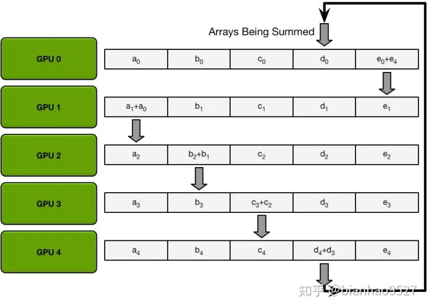
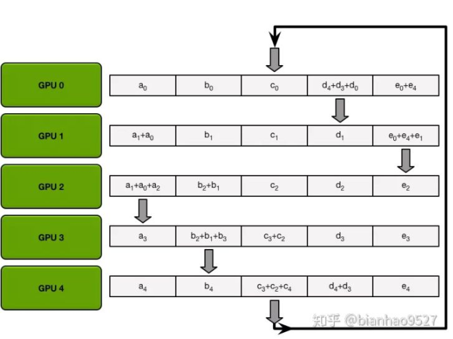
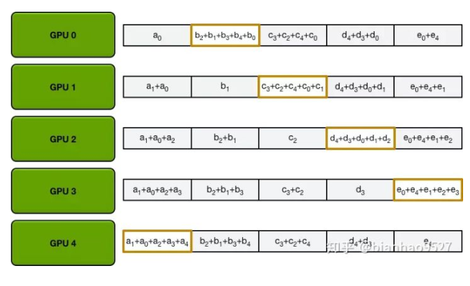
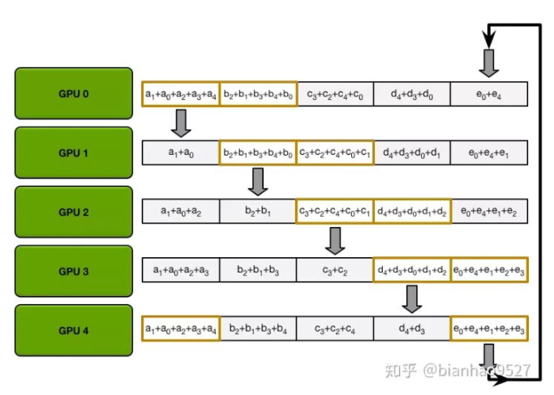

### MapReduce, All Reduce简介

https://www.zhihu.com/question/57799212

MapReduce 是分治算法的一种体现，所谓分治算法就是“就是分而治之 ，将大的问题分解为相同类型的子问题（最好具有相同的规模），对子问题进行求解，然后合并成大问题的解。

All Reduce 是一种去中心化的通信方式，相比于参数服务器的方法，PS每次需要收发 NxD 的数据量而言，all reduce 可以无需参数服务器，每个结点收发 2D 的数据量即可完成数据同步。

以 reduce sum 为例，在 Ring All Reduce 中每个节点在一个通信拓扑的环中，首先把数据分成N个块(N为节点数)，每个节点每次只收发其中的一块数据，每次通信传递的块不同，进行 N-1 次的通信后最终能保证每个节点有一块完整的 reduce 结果，再进行 all gather 即可， all gather 与 scatter-reduce 过程一致，只是不累加而是直接覆盖，每个节点进行 N -1 次通信后能使所有节点有最终结果。每个节点的收或发的数据量都是 2(N - 1) D / N。









### Python闭包

在一个外函数中定义了一个内函数，内函数里运用了外函数的临时变量，并且外函数的返回值是内函数的引用。这样就构成了一个闭包。

**对象是数据+一堆函数，闭包是一个带数据的函数。**

```python
#闭包函数的实例
# outer是外部函数 a和b都是外函数的临时变量
def outer( a ):
  b = 10
  # inner是内函数
  def inner():
    #在内函数中 用到了外函数的临时变量
    print(a+b)
  # 外函数的返回值是内函数的引用
  return inner
```

闭包可以让代码更简洁，可以实现装饰器的功能。

一个函数可以随意读取全局数据，但是要修改全局数据的时候有两种方法:

1 global 声明全局变量。

2 全局变量是可变类型数据的时候(list dict 之类的)可以修改。

### Lambda 表达式

lambda 并不会带来程序运行效率的提高，只会使代码更简洁。

函数可以接收函数做参数，有些时候，我们不需要显式地定义函数，直接传入匿名函数更方便，也就是lambda。

### 三个线程循环打印ABC

```python
import threading
import sys
import time
def showa():
    while True:
        lockc.acquire()   #获取对方的锁，释放自己的锁
        print('a',end='')
        sys.stdout.flush()   #释放缓冲区
        locka.release()
        time.sleep(0.2)
def showb():
    while True:
        locka.acquire()
        print('b',end='')
        sys.stdout.flush() 
        lockb.release()
        time.sleep(0.2)
def showc():
    while True:
        lockb.acquire()
        print('c',end='')
        sys.stdout.flush()
        lockc.release()
        time.sleep(0.2)
if __name__=='__main__':
    locka=threading.Lock()  #定义3个互斥锁
    lockb=threading.Lock()
    lockc=threading.Lock()
 
    t1=threading.Thread(target=showa)   #定义3个线程
    t2=threading.Thread(target=showb)
    t3=threading.Thread(target=showc)
 
    locka.acquire()   #先锁住a,b锁，保证先打印a
    lockb.acquire()
 
    t1.start()
    t2.start()
    t3.start()
```

